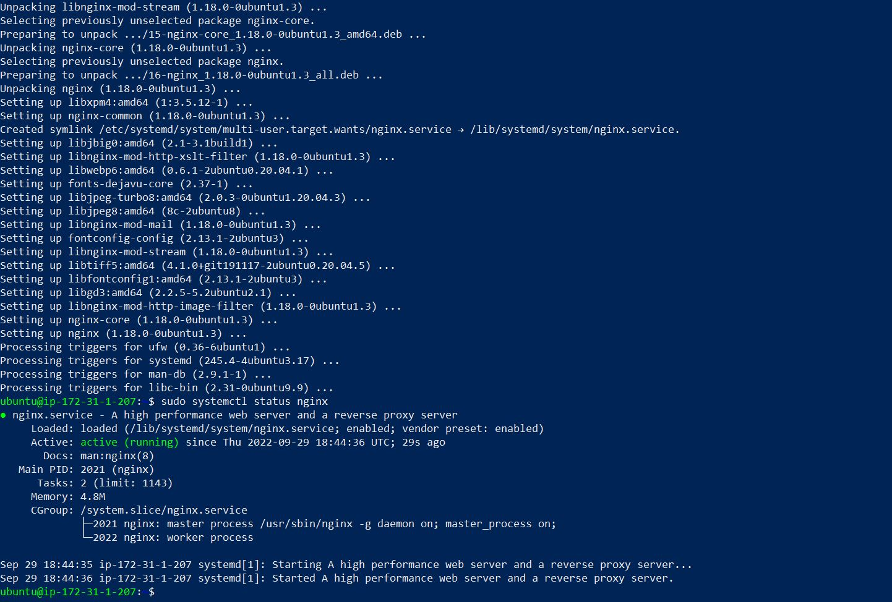
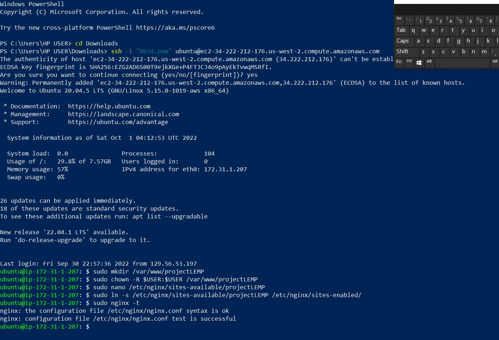

# DOCUMENTATION OF PROJECT TWO (LEMP)

## INSTALLATION OF NGINX

`sudo apt update`

`sudo apt install nginx`

`sudo systemctl status nginx`




## INSTALLATION OF MYSQL
`sudo apt install mysql-server`

`sudo mysql`

`ALTER USER 'root'@'localhost' IDENTIFIED WITH mysql_native_password by 'mynewpassword';`

`sudo mysql_secure_installation`

`sudo mysql -p`


## INSTALLATION OF PHP
`sudo apt install php-fpm php-mysql`


## CONFIGURING NGINX TO USE PHP PROCESSOR

`sudo mkdir /var/www/projectLEMP`

`sudo chown -R $USER:$USER /var/www/projectLEMP`

`sudo mkdir /var/www/projectLEMP`

`sudo nano /etc/nginx/sites-available/projectLEMP`



```
#/etc/nginx/sites-available/projectLEMP

server {
    listen 80;
    server_name projectLEMP www.projectLEMP;
    root /var/www/projectLEMP;

    index index.html index.htm index.php;

    location / {
        try_files $uri $uri/ =404;
    }

    location ~ \.php$ {
        include snippets/fastcgi-php.conf;
        fastcgi_pass unix:/var/run/php/php8.1-fpm.sock;
     }

    location ~ /\.ht {
        deny all;
    }

}

```

`sudo ln -s /etc/nginx/sites-available/projectLEMP /etc/nginx/sites-enabled/`

`sudo nginx -t`

`sudo unlink /etc/nginx/sites-enabled/default`

`sudo systemctl reload nginx`

`sudo echo 'Hello LEMP from hostname' $(curl -s http://169.254.169.254/latest/meta-data/public-hostname) 'with public IP' $(curl -s http://169.254.169.254/latest/meta-data/public-ipv4) > /var/www/projectLEMP/index.html`


## TESTING PHP WITH NGINX

`sudo nano /var/www/projectLEMP/info.php`

```
<?php
phpinfo();

```

`sudo rm /var/www/your_domain/info.php`


## RETRIEVING DATA FROM MYSQL DATABASE WITH PHP

`sudo mysql`

`CREATE DATABASE `example_database`;`

`CREATE USER 'example_user'@'%' IDENTIFIED WITH mysql_native_password BY 'password';`

`GRANT ALL ON example_database.* TO 'example_user'@'%';`

`exit`

`mysql -u example_user -p`

`SHOW DATABASES;`

`CREATE TABLE example_database.todo_list (item_id INT AUTO_INCREMENT, content VARCHAR(255), PRIMARY KEY(item_id));`

`INSERT INTO example_database.todo_list (content) VALUES ("My first important item");`

`SELECT * FROM example_database.todo_list;`

`exit`

`nano /var/www/projectLEMP/todo_list.php`

```
<?php
$user = "example_user";
$password = "password";
$database = "example_database";
$table = "todo_list";

try {
  $db = new PDO("mysql:host=localhost;dbname=$database", $user, $password);
  echo "<h2>TODO</h2><ol>";
  foreach($db->query("SELECT content FROM $table") as $row) {
    echo "<li>" . $row['content'] . "</li>";
  }
  echo "</ol>";
} catch (PDOException $e) {
    print "Error!: " . $e->getMessage() . "<br/>";
    die();
}

```