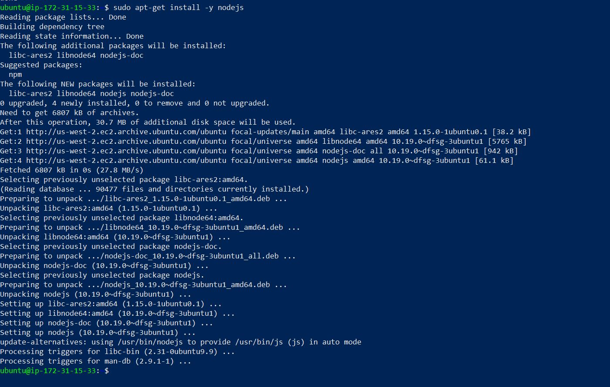

# DOCUMENTATION OF PROJECT THREE (MERN STACK IMPLEMENTATION)

## BACKEND CONFIGURATION

`sudo apt update`

`sudo apt upgrade`

`sudo apt-get install -y nodejs`



`node -v`

`npm -v`

`mkdir Todo`

`ls`

`cd Todo`

`npm init`

`ls`

## INSTALL EXPRESSJS

`npm install express`

`touch index.js`

`ls`

`npm install dotenv`

`vim index.js`

```
const express = require('express');
require('dotenv').config();

const app = express();

const port = process.env.PORT || 5000;

app.use((req, res, next) => {
res.header("Access-Control-Allow-Origin", "\*");
res.header("Access-Control-Allow-Headers", "Origin, X-Requested-With, Content-Type, Accept");
next();
});

app.use((req, res, next) => {
res.send('Welcome to Express');
});

app.listen(port, () => {
console.log(`Server running on port ${port}`)
});

```

`mkdir routes`

`cd routes`

`touch api.js`

`vim api.js`

```
const express = require ('express');
const router = express.Router();

router.get('/todos', (req, res, next) => {

});

router.post('/todos', (req, res, next) => {

});

router.delete('/todos/:id', (req, res, next) => {

})

module.exports = router;

```

## MODELS CREATION

`npm install mongoose`

`mkdir models`

`cd models`

`touch todo.js`

`vim todo.js`

```
const mongoose = require('mongoose');
const Schema = mongoose.Schema;

//create schema for todo
const TodoSchema = new Schema({
action: {
type: String,
required: [true, 'The todo text field is required']
}
})

//create model for todo
const Todo = mongoose.model('todo', TodoSchema);

module.exports = Todo;

```

`vim api.js`


```
const express = require ('express');
const router = express.Router();
const Todo = require('../models/todo');

router.get('/todos', (req, res, next) => {

//this will return all the data, exposing only the id and action field to the client
Todo.find({}, 'action')
.then(data => res.json(data))
.catch(next)
});

router.post('/todos', (req, res, next) => {
if(req.body.action){
Todo.create(req.body)
.then(data => res.json(data))
.catch(next)
}else {
res.json({
error: "The input field is empty"
})
}
});

router.delete('/todos/:id', (req, res, next) => {
Todo.findOneAndDelete({"_id": req.params.id})
.then(data => res.json(data))
.catch(next)
})

module.exports = router;

```

## MONGODB DATABASE

[MongoDB](https://https://www.mongodb.com/atlas-signup-from-mlab)

`sudo ln -s /etc/nginx/sites-available/projectLEMP /etc/nginx/sites-enabled/`

`sudo nginx -t`

`sudo unlink /etc/nginx/sites-enabled/default`

`sudo systemctl reload nginx`
